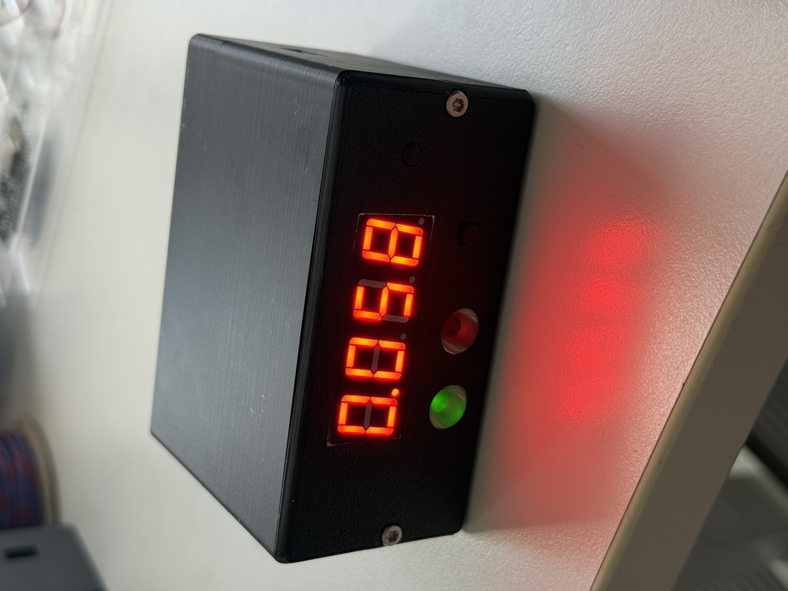
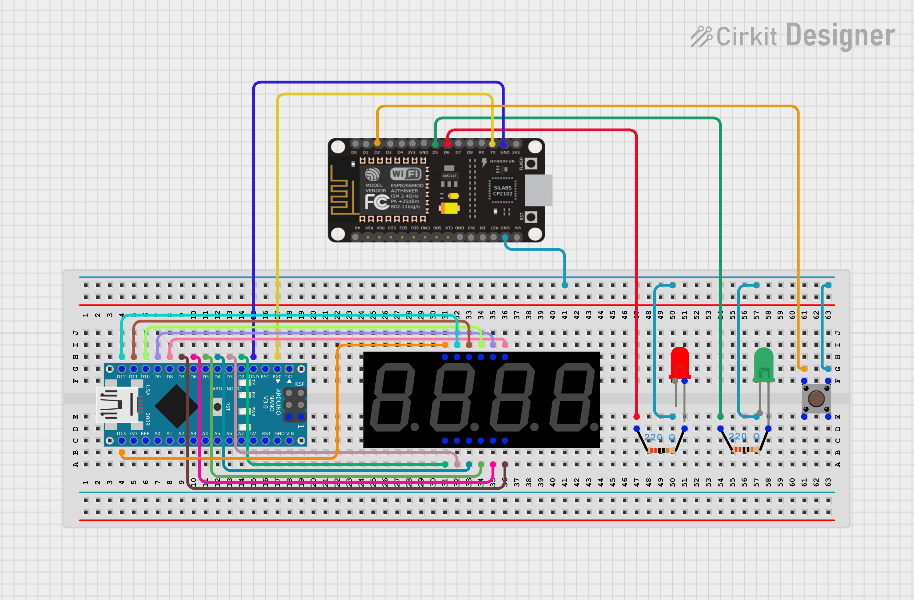

# ESP8266 BAC Display

This displays the BAC of a chosen user from the [telegram bot](https://github.com/magiskaa/telegram-bot). It can also add a drink in the [telegram bot](https://github.com/magiskaa/telegram-bot) with a button.



## Hardware

- Microcontrollers (ESP8266MOD 12-F and Arduino Nano)
- 4-digit 7-segment display
- A green and a red LED
- Two 220Ω resistors
- 4-pin pushbutton
- Jumper wires
- 3D-printed case
- Two M3 threaded inserts and two M3x10 screws

Wiring references:

- ESP8266 & Arduino Nano & 7-segment display 

## secrets.h

Path to secrets-file: `Sketches/secrets.h`

```cpp
#ifndef SECRETS_H
#define SECRETS_H

const char* SSID = "WIFI_SSID";
const char* PASSWORD = "WIFI_PASSWORD";

const char* SERVER_NAME = "http://IP_ADDRESS:PORT/PATH";

const char* USER_ID = "TELEGRAM_USER_ID";

#endif
```

## License

This project is licensed under the MIT License (see `LICENSE`).

## Contact

**Valtteri Antikainen**
vantikaine@gmail.com
